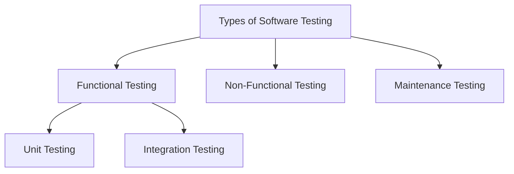
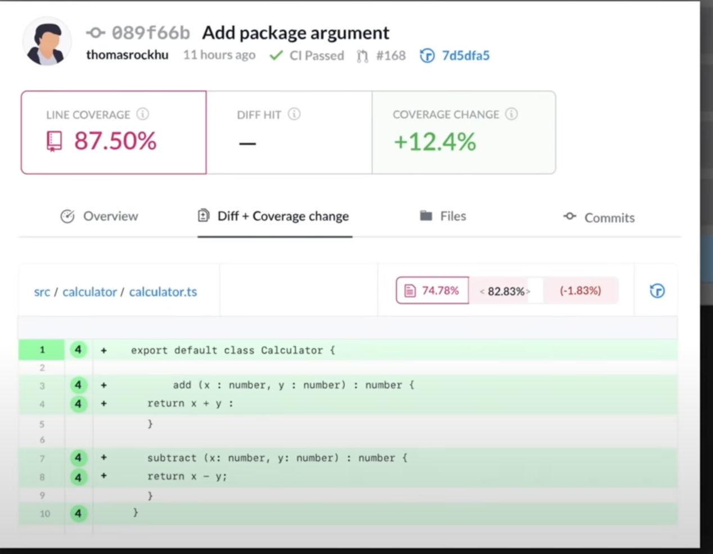

<h1 class="flex items-center">Testing on Cypress </h1>

Component testing

---

<Title>

# 📖 What is testing?
</Title>

<br>

Software testing is the process of evaluating and verifying that a software product or application does what it is supposed to do

<br>
<v-click>

## 🤔 Why do testing?

- 🐞 **Find bugs** - Indentify errors early and solve it before delivery of the software product
- 💰 **Cost-Efective** - Testing code on time helps to save money for the long term
- 🧑‍💻 **Confidence** - Helps to reduce the stress in development time

</v-click>

---

<Title>

# Tests types
</Title>
<div class="flex justify-center pt-12">




</div>
---
---

<Title>

# Example
</Title>

<Calculator />

---
---

<Title>

# Metrics
</Title>

### Coverage

<div class="pt-5" grid="~ cols-2 gap-4">
<div>
  
</div>
<div>

Test coverage is the number of lines in your code that are automatically tested

```ts {all|1|2-4|}
describe('Calculator', () => {
  it('Add correctly two numbers', () => {
    expect(add(1,2)).to.eql(3)
  })
})
```

</div>

</div>

<Modal v-click="4" class="text-center mt-5">
  <Headers>
    Tests that provide confidence, not improve metrics
  </Headers>
 </Modal>

---
layout: center
class: 'bg-dark-900'
---

<span class="text-6xl">🙋‍♀️ <Headers>Test as an user</Headers></span>

---

<Title>

# 
</Title>
<Store />

---

<Title>

# Test as an user
</Title>


```ts {all|1,2|3-}
describe('Product list', () => {
  it('should list all the products', () => {
    render(<ProductList />)

    cy.get('a').contains('Organize Basic Set (Walnut)');
    cy.get('a').contains('ORGANIZE PEN HOLDER');
    cy.get('a').contains('ORGANIZE STICKY NOTE HOLDER');
  })
})
```